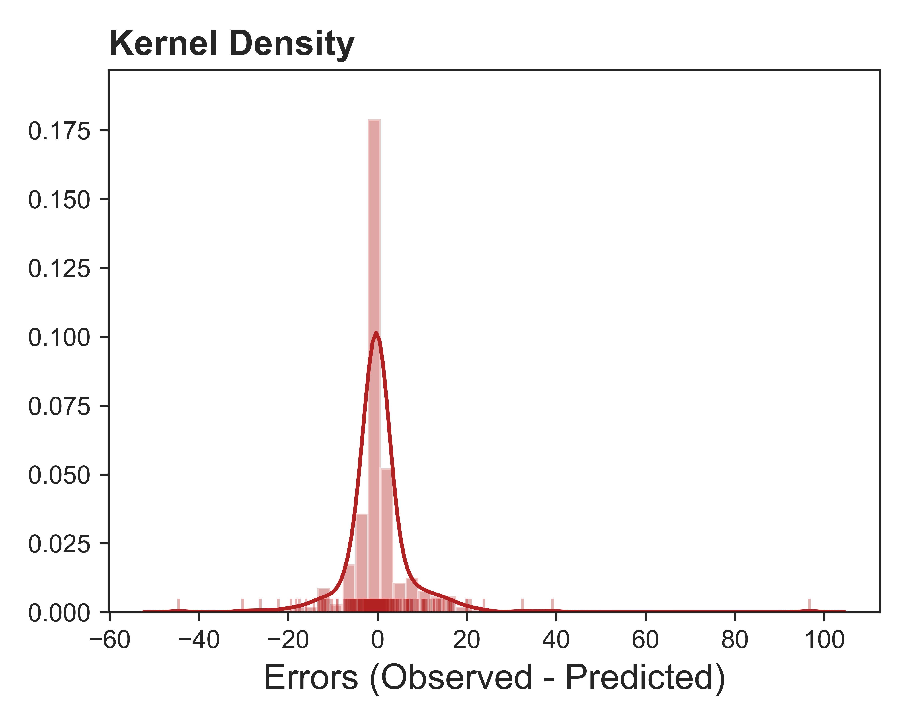
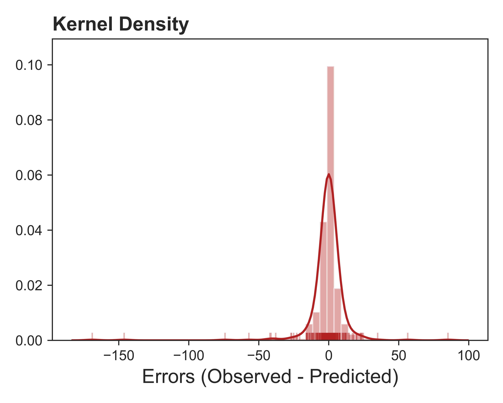
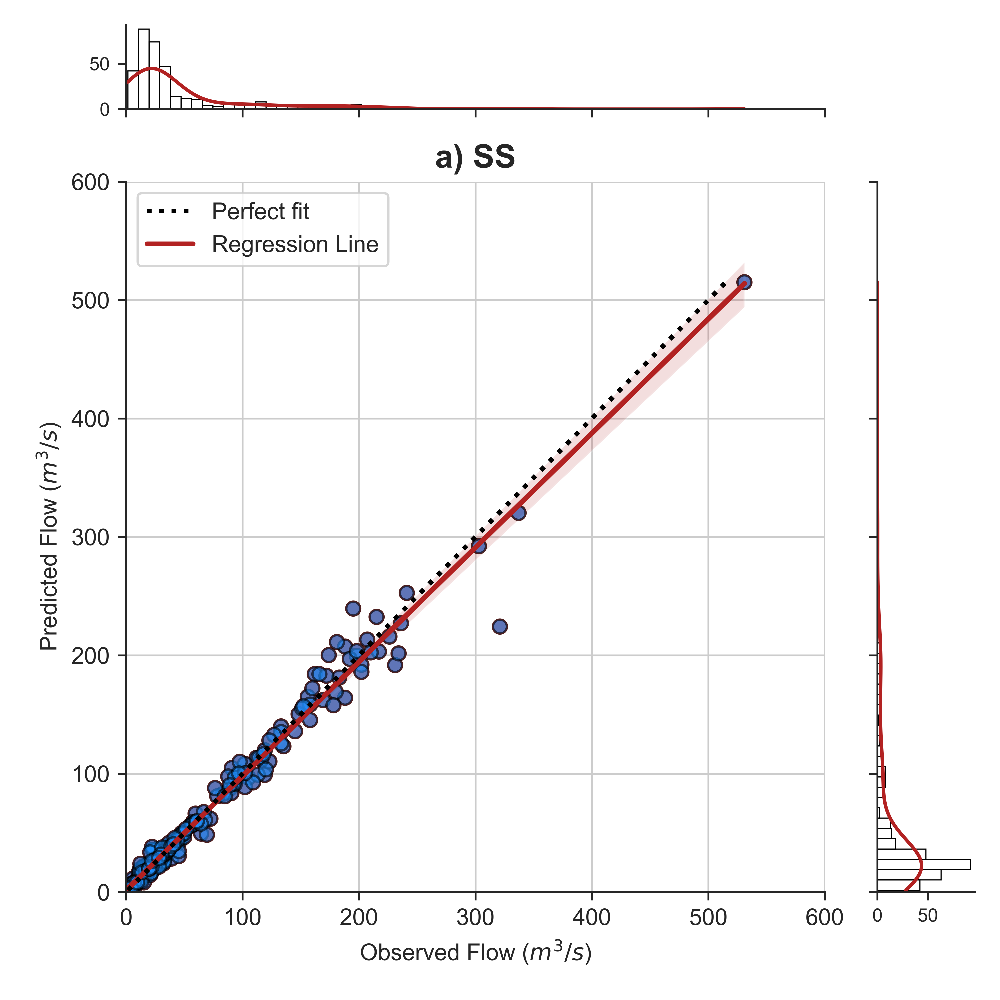
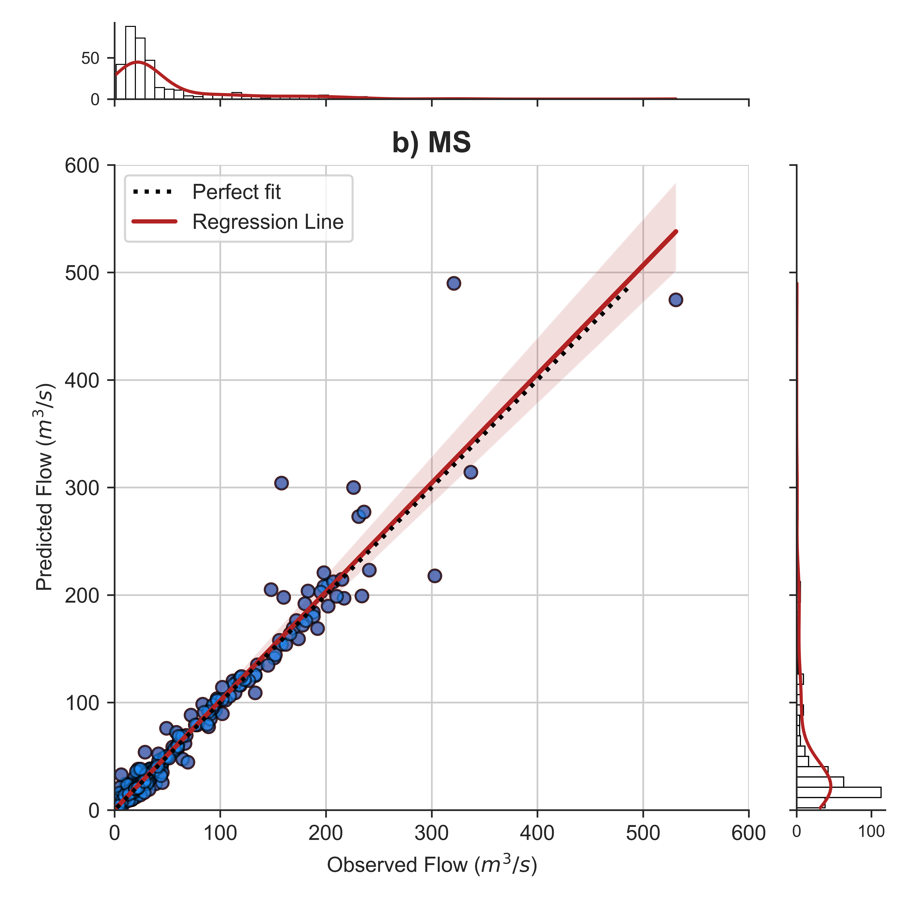

# Stream flow prediction
 Stream flow prediction with Random Forests

 Last column of input csv files is label or target variable. Remaning columns are organized as input variable or feature.

 ## Required Python packages:
 To organize data:
 * Numpy
 * Pandas
 
 To create and run Random Forests machine learning model:
 * scikit learn (https://scikit-learn.org/stable/)

## Errors between observed and predicted flows

Single Station Model:
 

Multi Station Model:
 

## Test vs Predict:

Single Station Model:
 

Multi Station Model:
 
